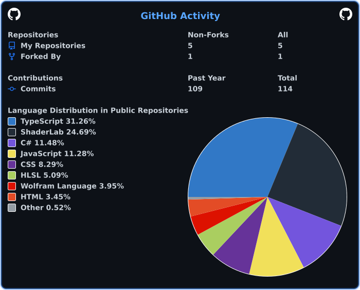

# Hi there, I'm Eugenia Gabriella 👋

**Software Development | Technology**

---

📧 Reach me at : tirtadjaja.eugenia@gmail.com

---

## 👩‍💻 About Me

- 🎓 High school student with a strong interest in technology and software development
- 💡 I enjoy turning ideas into projects, from interactive applications and games to different kinds of digital products
- 🧩 I learn through building, experimenting, and solving problems along the way

---

## 🛠️ Tech Stack

<table>
  <tr>
    <th width="25%">Areas</th>
    <th>Languages, Tools, and Development Environments</th>
  </tr>

  <tr>
    <td> Web Development</td>
    <td>
      
      &nbsp;&nbsp;&nbsp;
      
      &nbsp;&nbsp;&nbsp;
      
    </td>
  </tr>

  <tr>
    <td> Game Development</td>
    <td>
      
      &nbsp;&nbsp;&nbsp;
      
    </td>
  </tr>

  <tr>
    <td> Programming</td>
    <td>
      
      &nbsp;&nbsp;&nbsp;
      
    </td>
  </tr>

  <tr>
    <td> UI/UX & Design</td>
    <td>
      
    </td>
  </tr>

  <tr>
    <td> Development Tools</td>
    <td>
      
      &nbsp;&nbsp;&nbsp;
      
      &nbsp;&nbsp;&nbsp;
      
    </td>
  </tr>
</table>

---

## 🚀 Featured Projects

<table>
  <tr>
    <th width="20%">Project</th>
    <th>Description</th>
  </tr>

  <tr>
    <td>
      <a href="https://github.com/eugeniagabriella/THE-RITUAL"><strong> THE RITUAL</strong></a>
    </td>
    <td>
      A first-person indie horror game independently developed with Unity and C#.
    </td>
  </tr>

  <tr>
    <td>
      <a href="https://github.com/eugeniagabriella/FEMORA"><strong> FEMORA</strong></a>
    </td>
    <td>
      A web platform designed to improve access to information and public services
      for women and girls in rural communities.
    </td>
  </tr>

  <tr>
    <td>
      <a href="https://github.com/eugeniagabriella/DompetKu"><strong> DompetKu</strong></a>
    </td>
    <td>
      A web-based Web3 wallet exploring blockchain-based digital asset management.
    </td>
  </tr>

  <tr>
    <td>
      <a href="https://github.com/eugeniagabriella/Tranquil.AI"><strong> Tranquil.AI</strong></a>
    </td>
    <td>
      An AI-powered application that integrates modern language models to create intelligent and interactive user experiences. This       
      project explores the use of GPT-based systems and API integration to build practical AI-driven solutions.
    </td>
  </tr>
</table>

---

## 📊 GitHub Stats

  
  
  

